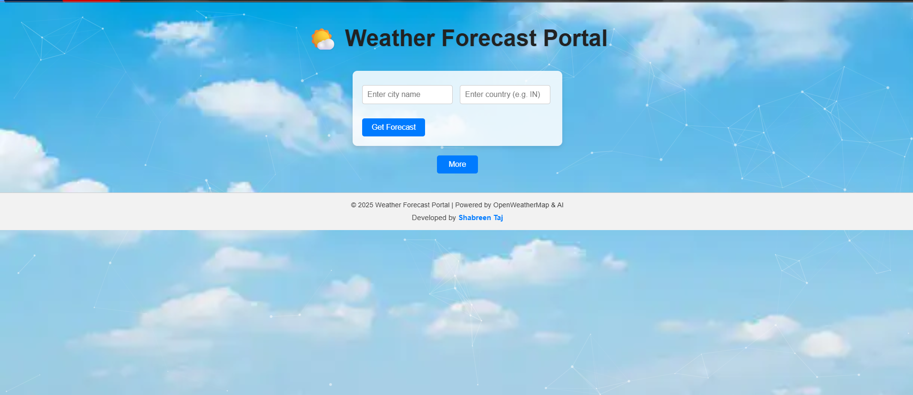
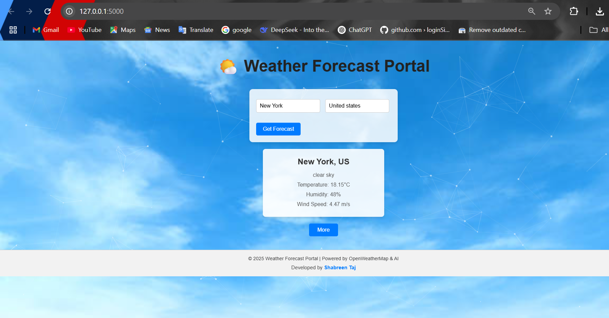
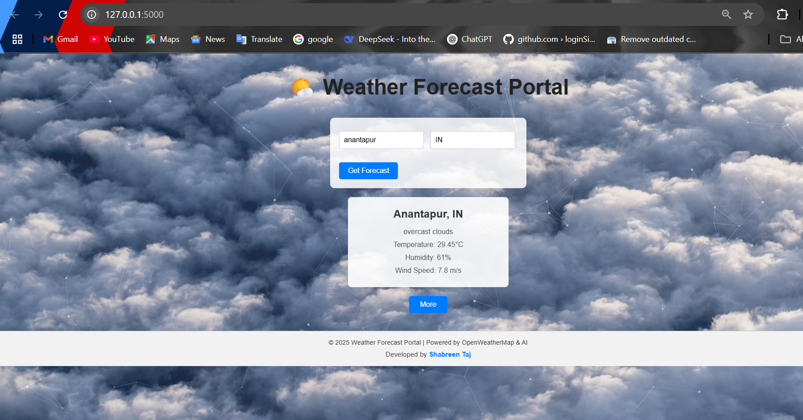
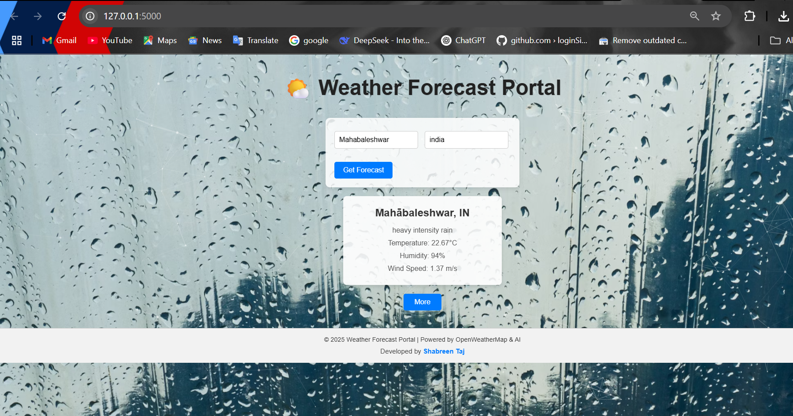
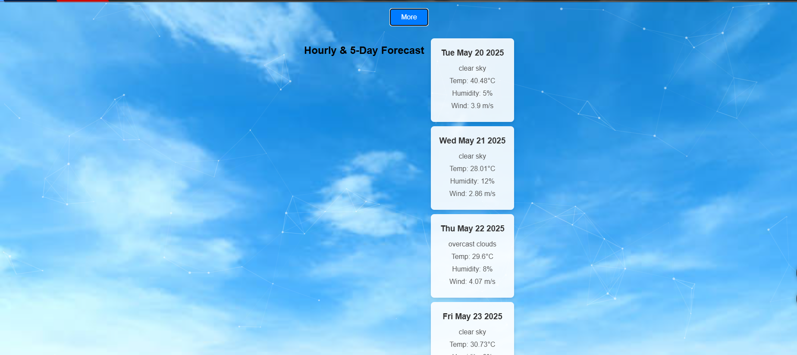
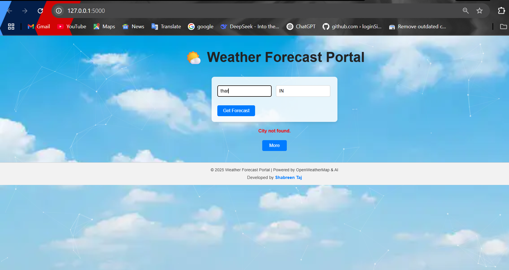

# 🌦️ Weather Forecast Web App using OpenWeather API


An interactive and responsive web application built with Flask that fetches and displays real-time 5-day weather forecasts using the OpenWeatherMap API. This project showcases dynamic UI updates with custom background themes based on weather conditions (e.g., thunderstorm, snow, clear sky), as well as form validation, error handling, and modular Python backend design.

---

## 📁 Project Structure
```bash
weather_forecast_app/
│
├── app/
│ ├── static/
│ │ ├── css/
│ │ │ └── style.css
│ │ ├── js/
│ │ │ └── scripts.js
│ │ ├── images/
│ │ │ └── icons/ (weather icons like sunny, rainy, etc.)
│ │ └── animations/
│ │ └── ... (Lottie or CSS animations)
│ │
│ ├── templates/
│ │ ├── index.html
│ │ ├── result.html
│ │ └── error.html
│ │
│ ├── utils/
│ │ └── weather_api.py # Handles API requests and parsing
│ │
│ ├── init.py
│ └── routes.py # Main Flask routes
│
├── .env # For API keys and secrets (excluded in .gitignore)
├── config.py
├── run.py # Entry point
├── requirements.txt
├── results/ # Screenshots of UI and different weather result samples
│ ├── result1.png
│ ├── result2.png
│ ├── ...
└── README.md

```
---

## 🚀 Features
- 📅 Displays 5-day weather forecast with detailed temperature, humidity, and condition updates.
- 🔍 Fetches real-time 5-day weather forecasts based on user input (city & country).
- 🎨 Dynamic background changes for weather types: Clear, Cloudy, Rain, Thunderstorm, Snow, etc.
- ✅ Input validation and clean error messaging.
- 📦 Modular Flask app structure using Blueprints.
- 📊 Lottie/CSS animations for enhanced UX.
- 🌐 Deployed-ready and API-agnostic.

---

## 🧪 How It Works

1. User enters a city and country.
2. The Flask backend (`weather_api.py`) queries the [OpenWeatherMap API](https://openweathermap.org/forecast5).
3. Parsed JSON data is returned and sent to the frontend.
4. Based on the `weather[0].main` field, the background and UI elements adjust dynamically.

---

## 🔧 Setup Instructions

### 1. Clone the Repo

```bash
git clone https://github.com/taj-shabreen/weather-forecast-webapp-openweather.git
cd weather-forecast-webapp-openweather
```
## 2. Create a Virtual Environment (optional but recommended)
```
python -m venv venv
source venv/bin/activate  # Linux/Mac
venv\Scripts\activate     # Windows
```
## 3. Install Requirements
```
pip install -r requirements.txt
```
## 4. Add API Key
Create a .env file in the root directory and add:
```
OPENWEATHER_API_KEY=your_api_key_here
```
## 5. Run the App
```
python run.py
Then open your browser and go to: http://127.0.0.1:5000/
```
## 🖼️ Screenshots
Located in the results/ folder:

### 🧪 Application Interface Overview


### 🌧️ Clear Weather 


### ☁️ Cloudy Weather View


### ☁️ Rainy Weather View


### ❄️ Snow Weather UI


### 📅 5-Day Forecast View


### ❌ City Not Found Response



## ✅ To-Do (Future Enhancements)
🚀 Planned upgrades to transform this from a weather API integration project into a more intelligent, data-driven, and scalable system:

📈 Interactive Historical Weather Visualization
Integrate historical weather datasets and display temperature/rainfall trends using Plotly or Dash.

🤖 AI/ML-Based Weather Prediction
Build machine learning models to forecast temperature, precipitation, and conditions using regression or time-series forecasting (LSTM/ARIMA).

🛰️ Satellite Imagery + Deep Learning
Connect to satellite APIs (e.g., NASA or Sentinel Hub) and classify weather patterns using CNNs (Convolutional Neural Networks).

📱 Enhanced UX & Accessibility
Improve mobile responsiveness, keyboard navigation, and screen-reader support for a more inclusive design.

🐳 Containerization with Docker
Dockerize the application for seamless deployment, portability, and team collaboration.

## 📌 Technologies Used
🛠️ Core technologies and tools that power this project:

🧠 Python 3.11 – Core backend language

🔥 Flask – Lightweight web framework for routing and templating

☁️ OpenWeatherMap API – Real-time weather forecast data

🌐 HTML5 & CSS3 – Semantic, responsive UI layout

⚡ JavaScript  – Dynamic frontend behavior and interactivity

🎨 CSS Animations  – Weather-based theme transitions

🔐 python-dotenv – Environment variable and API key security

🌍 Requests – HTTP client for handling REST API communication

📦 requirements.txt – Python dependency management


## 👨‍🚀 About the Author
Hey there! I'm Shabreen Taj — a developer, dreamer, and digital tinkerer on a mission to fuse code with creativity.

  📫 Let's connect: [GitHub @taj-shabreen](https://github.com/taj-shabreen)

## 🌟 Show Your Support
If this project inspired you, helped you, or just looked cool —
 give it a ⭐ star on GitHub!
